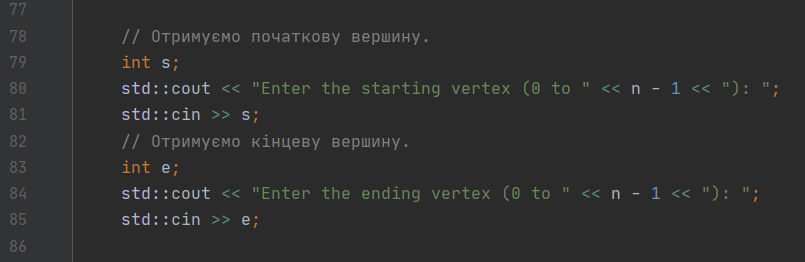
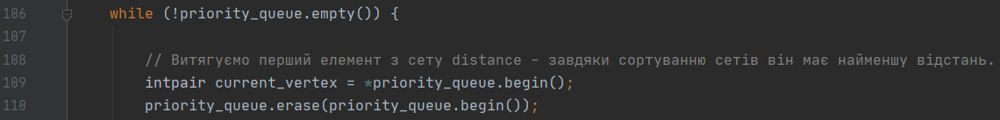
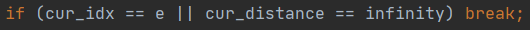
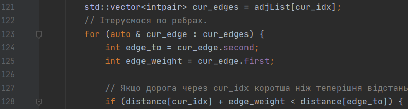
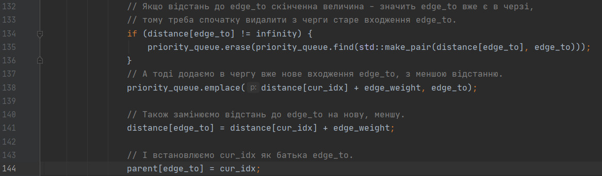
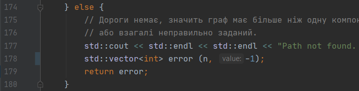
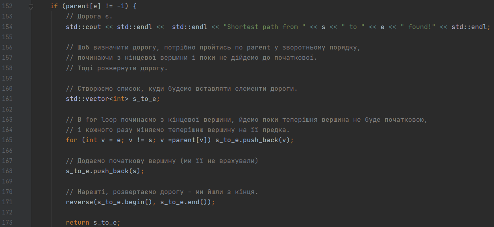
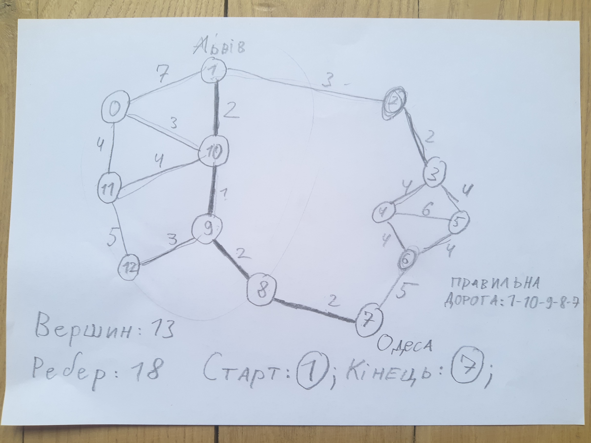

**УКРАЇНСЬКИЙ КАТОЛИЦЬКИЙ УНІВЕРСИТЕТ**

**ФАКУЛЬТЕТ ПРИКЛАДНИХ НАУК**

**Комп'ютерні науки**

1 червня 2020 року

*@ Міщенко Ярема*

# Dijkstra Algorithm

Цей проект реалізує алгоритм Дейкстри знаходження найкоротшого
шляху між двома вершинами графу.

Цей проект використовує знання теорії графів, термінологію графів, а також вміння реалізувати граф мовою програмування.

Проект є прямою інтерпретацією алгоритму Дейкстри на мові C++.

## Технічні характеристики

Мова - С++

Компілятор - gcc-c++

Часова складність - O((N + M) * logN), де N - кількість вершин, а M - кількість ребер графу.
Це може означати різні речі. В тісно заповненому графі, де M ~ N^2, складність наближається до O(N^2 * logN).
А от в розрідженому графі, де M ~ N, складність - O(N * logN).

Просторова складність - O(N + M) - розмір списку суміжності. Знову ж таки, за аналогією ця складність може мінятись
від O(N) до O(N^2) в залежності від типу графу.

## Псевдокод

Нагадування: в файлі `main.cpp` є значна кількість коментарів, які ще краще пояснюють роботу програми.

Програма поділяється на дві частини.

- Ввід графу для роботи алгоритму.
Для того, щоб можна було використати алгоритм Дейкстри, спочатку потрібно збудувати граф.
Це я роблю за допомогою численних інпутів в юзера:

    

    Таким чином, я створюю список суміжності графа, а потім заповнюю кожне ребро по черзі.
    В кінці ще приймаю початкову і кінцеву вершину, між якими потрібно знайти шлях (на фото).

- Після цього починається робота самого алгоритму Дейкстри.
Спочатку створюємо пріоритетну чергу, в яку будемо додавати вершини та їх відстані для аналізу,
пріоритет по найменшій відстані. Вона реалізована за допомогою контейнера set в С++
(пояснення типів даних на початку програми)

        std::set<intpair> priority_queue;
        priority_queue.emplace(0, s);

    Ставимо в цю чергу початкову вершину s, з відстанню 0.
    
    Також треба створити масиви distance та parent. Перший позначає відстань до вершини n за індексом n
    (стандартно це нескінченність).
    Другий позначає предка вершини n за індексом n, тобто вершину, з якої ми прийшли в n.
    
    Починається алгоритм. Поки черга не стане пустою, витягуємо першу вершину в черзі
    і проводимо з нею певні маніпуляції:
    
    

    Ця вершина з черги видаляється.
    
    Якщо дана вершина є кінцевою - зупиняємо ітерацію.

    
    
    Також зупиняємось якщо відстань до даної вершини - нескінченність.
    Таке може статись тільки якщо дана вершина в іншій компоненті від початкової, отже,
    розглядати далі немає сенсу.
    Таким чином, алгоритм здатен повністю розглянути одну компоненту графа, і якщо кінцева вершина в ній -
    ми її знайдемо.
    
    Якщо дана вершину пройшла перевірку, алгоритм продовжується,
    і ми розглядаємо всі ребра, які виходять з неї.

    

    Більше про синтаксис ітерації С++ - на початку програми.
    
    Як бачимо, кожне ребро проходить if-перевірку.
    Якщо теперішня відстань до вершини на іншому кінці ребра (записана в distance) більша за нову відстань
    (відстань до теперішньої вершини + довжина ребра між ними), тоді ми знайшли коротший шлях
    до вершини на іншому кінці ребра. Потрібно змінити всі важливі параметри цієї вершини.
    - З пріоритетної черги видалити старе входження цієї вершини (якщо вона там вже була),
    і додати нове, з коротшою відстанню.
    - В distance записати нову відстань до цієї вершини: відстань до теперішньої вершини + довжина ребра.
    - В parent змінити предка цієї вершини на теперішню вершину - тепер ми йдемо крізь неї.
    
    
    
    Якщо ж стара відстань менша або рівна до нової - ми не знайшли кращого шляху, йдемо далі.

---

В результаті ми пройдемо всі вершини в компоненті, поки не дойдемо до кінцевої.
На цьому етапі ітерація закінчується, і ми вже знайшли найкоротшу відстань до кінцевої вершини.

Залишається лише відновити шлях до неї. Це робиться за допомогою масиву parent.
Для початку, перевіряємо чи `parent[end-vertex]` існує. Якщо граф неправильно заданий,
чи кінцева вершина в іншій компоненті, ми не знайшли шляху, і треба видати відповідний текст користувачу.

Для цільності алгоритму ми все ж таки повертаємо список, але замість вершин шляху він заповнений -1.

А от якщо в кінцевої вершини є parent, то шлях до неї точно існує.
Повертаючись назад, шукаємо parent\`а попередньої вершини, і так аж поки не знайдемо початкову вершину.
Тоді залишається лише розвернути шлях, щоб отримати його від початку і до кінця. Шлях повертаємо.

На цьому алгоритм закінчується.

## Висновки

Цей проект був цікавим і пізнавальним. Я не тільки краще зрозумів, як працює алгоритм Дейкстри,
але і навчився краще писати код на С++. Тепер, коли я власноруч імплементував алгоритм,
буде не тяжко його написати ще раз, коли це буде необхідно, тому цей проект мав і практичне значення для мене.

Найважливіше - я зрозумів, як складно писати чіткі і зрозумілі коментарі, щоб інші могли читати твій код :D

## Додаткова інформація

### Використання

Для запуску програми можна використати один з наступних варіантів:
1. Запустити через середовище. Наприклад, в CLion IDE ви можете створити C++ Executable проект,
скопіювати код в файл `main.cpp`, і тоді запустити проект.
2. Створити `.exe` файл, який виконується при відкритті, за допомогою компілятора C++.
Наприклад, якщо у вас встановлений компілятор gcc-c++/g++, виконайте

        g++ main.cpp -o dijkstra_algorithm

    в папці, в яку ви скачали файл `main.cpp`, і в тій папці з'явиться `dijkstra_algorithm.exe`.
Відкрийте цей файл, і програма запуститься.
3. Використати онлайн-компілятор C++
    1. [repl.it](https://repl.it/languages/cpp)
    2. [cpp.sh](http://cpp.sh/)
    3. [onlinegdb.com](https://www.onlinegdb.com/online_c++_compiler)
    
    Роботу з цими програмами вам доведеться освоїти без мене.

### Ініціалізація графу

В алгоритм входить також і створення графу. Для тесту пропоную використати такий граф,
з даною початковою та кінцевою вершиною.

---

---

В даному графі ми намагаємось проїхати від Львова - 1 до Одеси - 7 (абстракція)

Правильна дорога позначена справа.

Інпут для цього графу (просто скопіюйте без лапок):

> "13 18 0 1 7 0 10 3 0 11 4 1 10 2 1 2 3 2 3 2 3 4 4 3 5 4 4 5 6 4 6 4 5 6 4 6 7 5 7 8 2 8 9 2 9 12 3 9 10 1 10 11 4 11 12 5"

Цей ввід еквівалентний графу з фотографії.
В С++ можна ввести всі інпути за раз, через пробіли, і тоді вони всі заповняться зразу.
Потім треба ввести початкову і кінцеву вершину, в даному випадку це 1 (Львів) та 7 (Одеса).
Можете вибрати свої.

Ремарка: якщо вводити все одночасно, тексти вводу з'являться всі разом, невідформатовані. Це нормально.

### Вивід

За даними з попереднього розділу, ви маєте отримати такий текст на виході:

    Shortest path from 1 to 7 found!
    1->10->9->8->7
    
    Program done. Type 'quit' to end execution.

Якщо вивід не такий - алгоритм зламався. Але такого не має бути.

**ДЯКУЮ ЗА УВАГУ!**